# Cloud Computing – Lab 2

**Fatima Jinnah Women University**

**Subject:** Cloud Computing  
**Name:** Urwa Zahra (5-B)  
**Registration Number:** 2023-BSE-068  
**Submitted To:** Sir Muhammad Shoaib  

---

## 📘 Overview

This lab demonstrates how to use Git and GitHub for version control in cloud-based environments.  
It covers repository creation, SSH setup, user configuration, branching, merging, and pull requests.  
Each task includes screenshots showing step-by-step implementation.

---

## 🧩 Task 1: Create Private GitHub Repository
A private repository was created on GitHub to store and manage lab files.  
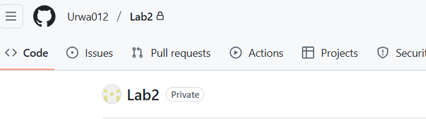

---

## 🧩 Task 2: Connect Repository via SSH
Generated an SSH key and connected it with GitHub for secure authentication.  
  
  
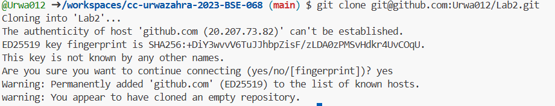

---

## 🧩 Task 3: Configure Git Username and Email
Configured Git identity using commands `git config --global user.name` and `git config --global user.email`.  
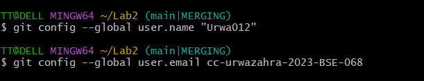  

---

## 🧩 Task 4: Explore the .git Folder
Initialized a Git repository and explored the `.git` folder structure.  
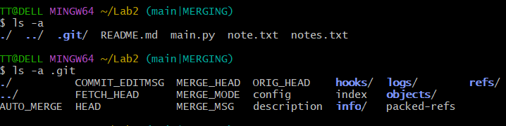  
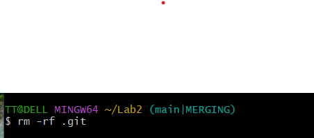

---

## 🧩 Task 5: Local Repository Management
Initialized a local repository using `git init` and performed the first commit.  
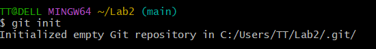  
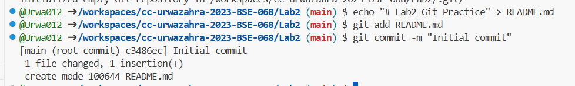  
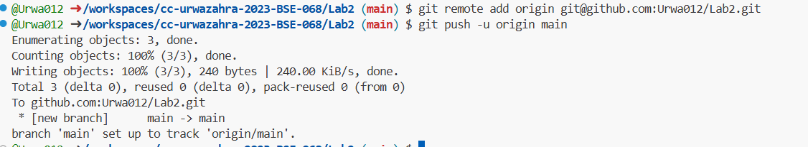

---

## 🧩 Task 6: File Status & Staging
Checked file status using `git status` and staged files using `git add`.  
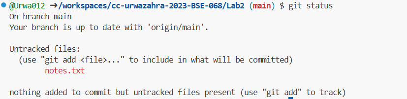  
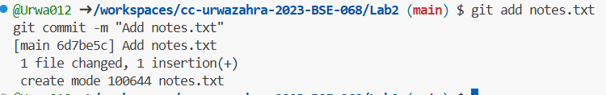

---

## 🧩 Task 7: Branch Creation Using GitHub GUI
Created a new branch (e.g., `bugfix`) through the GitHub web interface.  
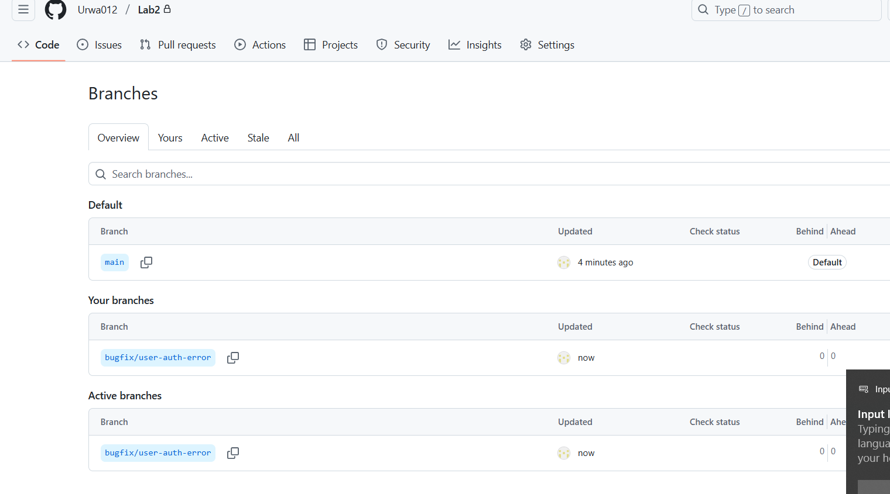

---

## 🧩 Task 8: Branch Creation and Push Using Git Bash
Created and pushed a new branch using Git Bash commands.  
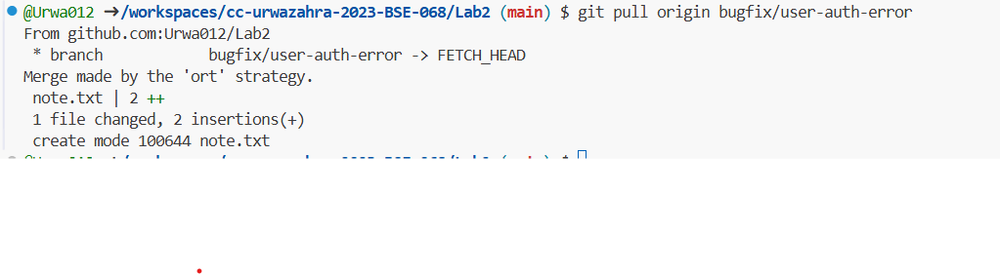  
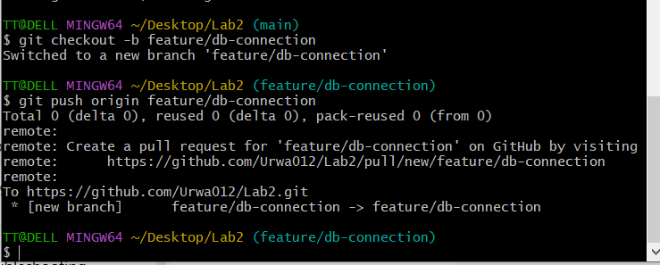  
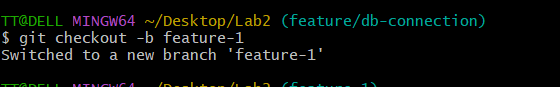

---

## 🧩 Task 9: Branching & Merging
Performed branch merging to integrate changes from different branches into `main`.  
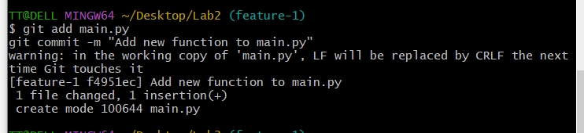  
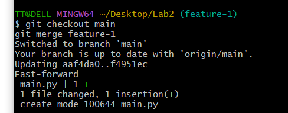  
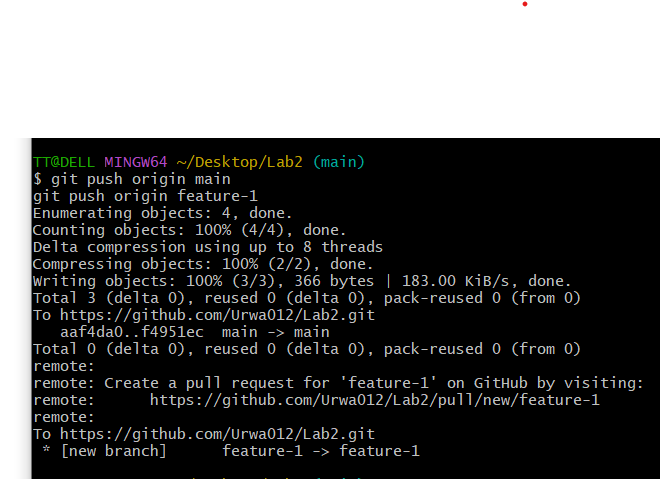

---

## 🧩 Task 10: Pull Request and Branch Review (GitHub GUI)
Created a pull request on GitHub and reviewed changes before merging.  
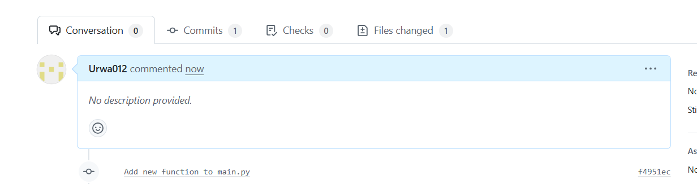  
  
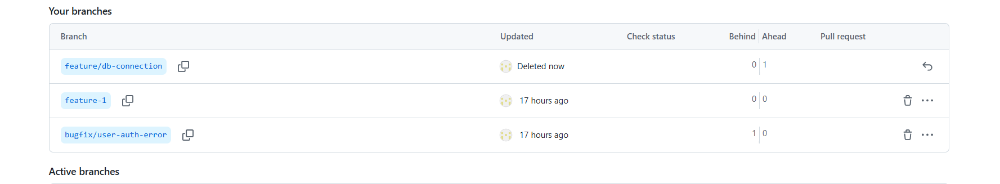

---

## 🧩 Task 11: Detailed Branch Strategy (Develop/Staging)
Implemented a multi-branch strategy with develop, staging, and main branches.  
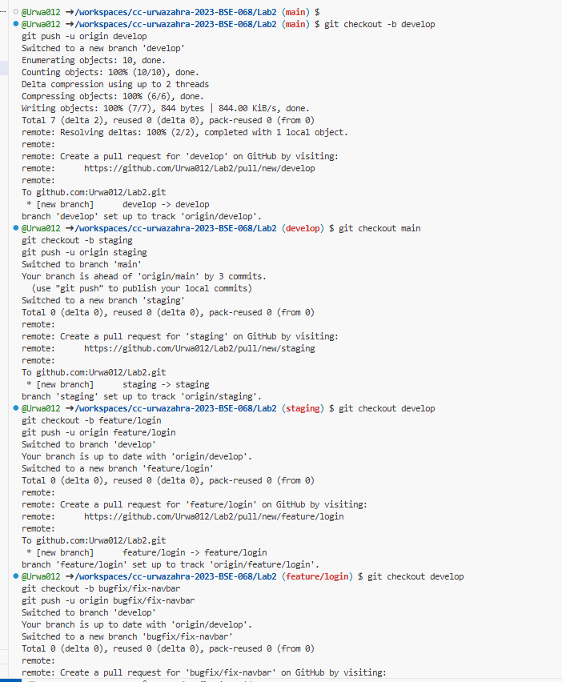  
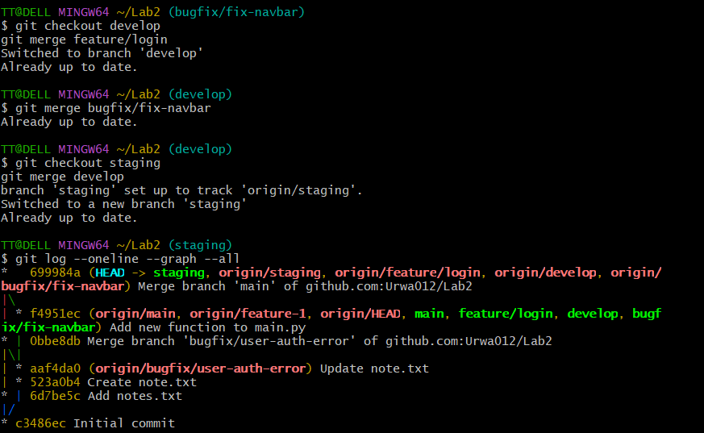  
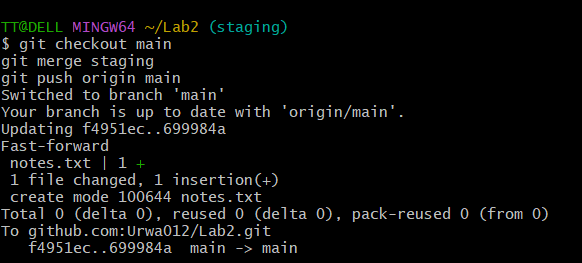

---

## 🧩 Task 12: Code Review Workflow
Performed a complete pull request review process including approvals and rejections.  
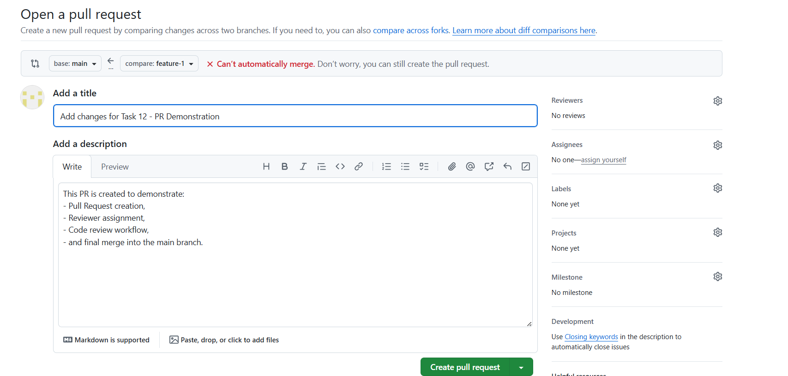  
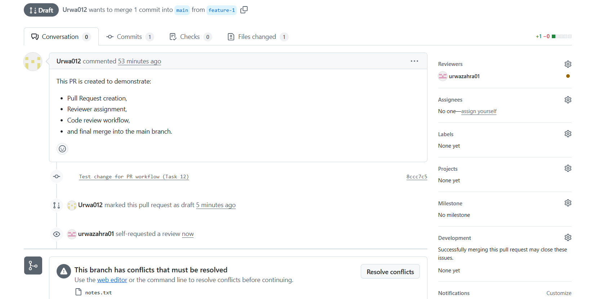  
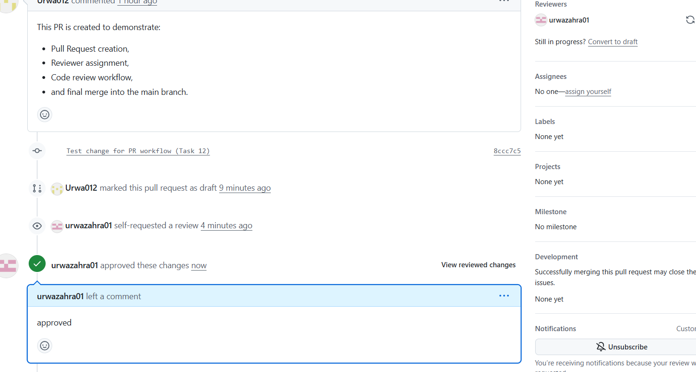  
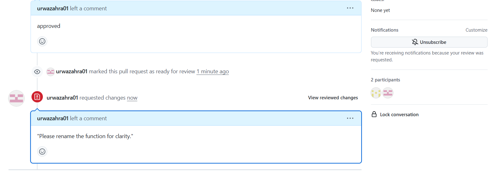  
  
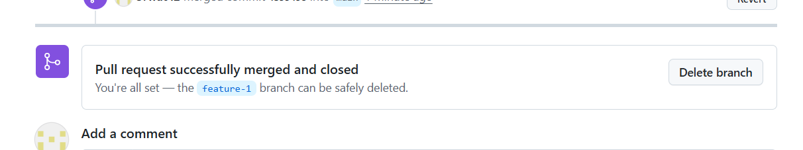  
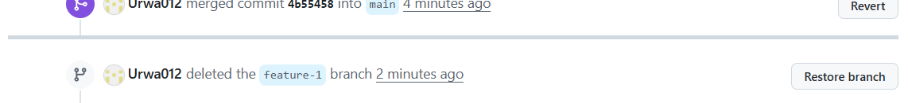

---

## 🧮 Exam Evaluation Questions

### Q1: Branch Creation and Merge Process
Demonstrated branch creation, commit, and merge operations.  
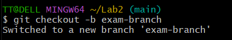  
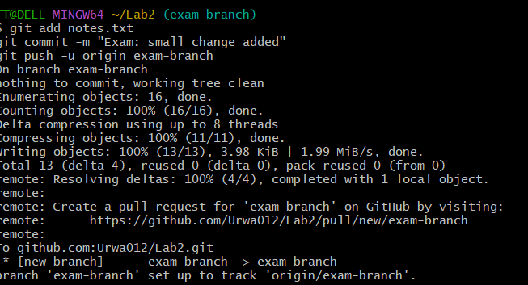  
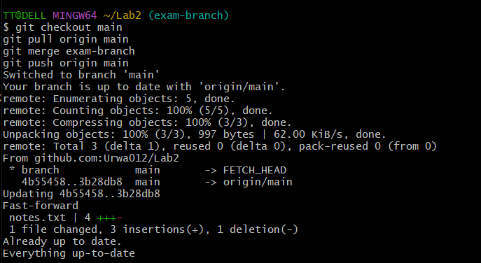  
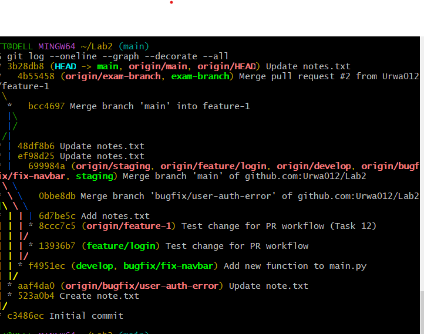

---

### Q2: Multi-Branch Workflow
Showed feature branch creation and merging into develop, staging, and main branches.  
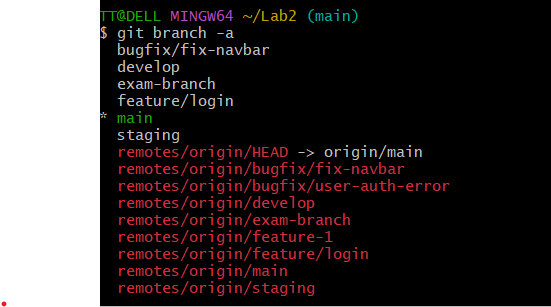  
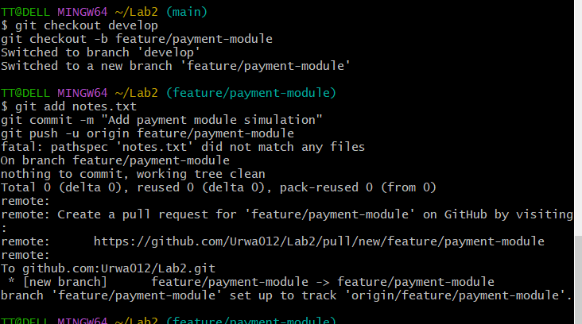  
  
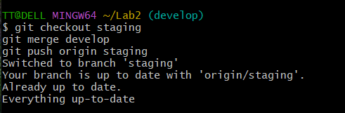  
  
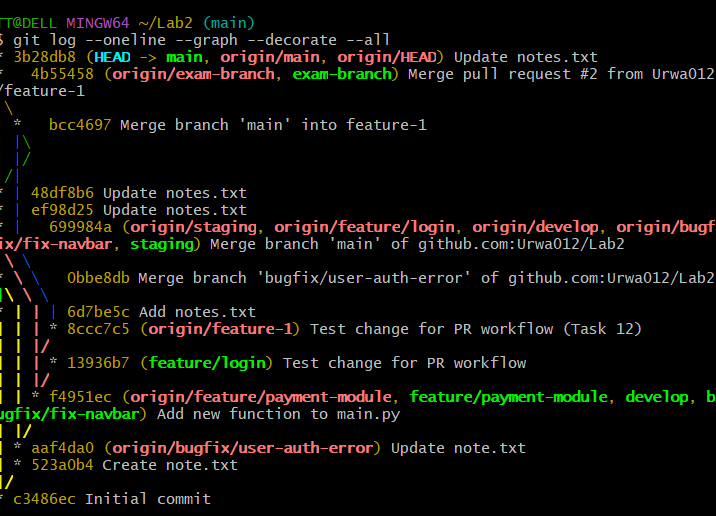

---

### Q3: Branch Modifications
Made changes in different branches and merged updates as part of code review.  
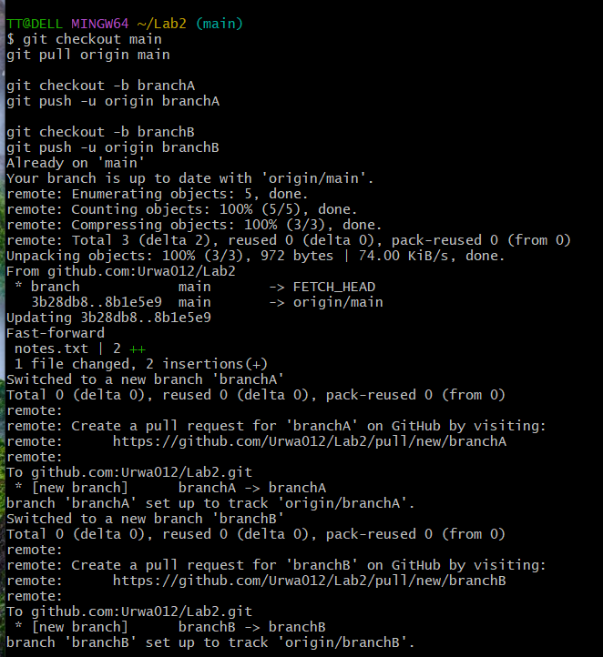

