# ☁️ Cloud Computing – Lab 04  
### Virtualization & Linux Fundamentals

---

### 🏫 Course
BSE (V-B)

### 👩‍🎓 Submitted By
**Name:** Urwa Zahra  
**Roll No:** 2023-BSE-068 

### 👨‍🏫 Submitted To
**Instructor:** Sir Muhammad Shoaib  

---

## 🧪 Task 1 – VM Configuration

**VM hardware specifications:**  
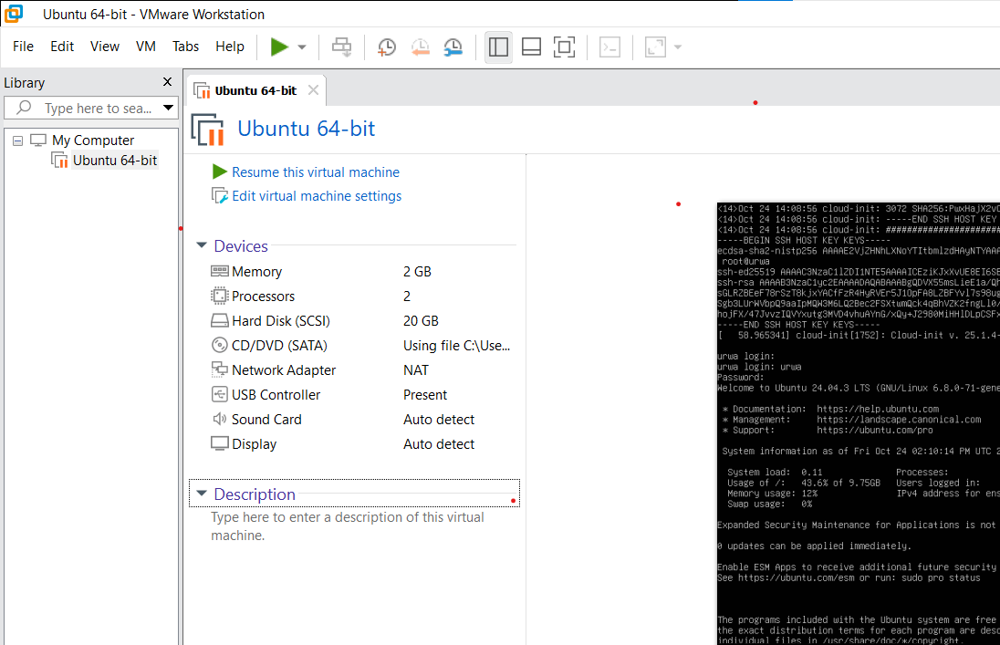

---

## 🧩 Task 2 – SSH & User Verification

**SSH connection from host to Ubuntu VM:**  
.png)

**User and working directory confirmation:**  
.png)

---

## 📂 Task 3 – Linux Directory Structure

**Root directory listing:**  
.png)

**Executable binaries in /bin:**  
.png)

**System binaries in /sbin:**  
.png)

**User programs in /usr:**  
.png)

**Optional software directory (/opt):**  
.png)

**System configuration directory (/etc):**  
.png)

**Device files directory (/dev):**  
.png)

**Variable files and logs (/var):**  
.png)

**Temporary files directory (/tmp):**  
.png)

**Home directory contents (including hidden files):**  
.png)

**Explanation of /bin, /usr/bin, and /usr/local/bin:**  
.png)

---

## 🧠 Task 4 – File Operations & Navigation

**Created workspace folder:**  
.png)

**Navigated to workspace directory:**  
.png)

**Checked current working directory:**  
.png)

**Created README.md using nano:**  
.png)

**Created main.py file with print statement:**  
.png)

**Created .env file with environment variable:**  
.png)

**Listed all workspace files including hidden ones:**  
.png)

**Copied README.md file:**  
.png)

**Renamed copied README file:**  
.png)

**Deleted renamed file:**  
.png)

**Created new folder java_app:**  
.png)

**Copied folder recursively:**  
.png)

**Verified copied folders:**  
.png)

**Viewed recent command history:**  
.png)

**Demonstrated tab auto-completion:**  
.png)

---

## ⚙️ Task 5 – System Profiling & Process Monitoring

**Kernel and OS information:**  
.png)

**CPU model and core details:**  
.png)

**Memory usage (free -h):**  
.png)

**Disk usage (df -h):**  
.png)

**Ubuntu release version:**  
.png)

**List of active processes (ps aux):**  
.png)

---

## 👥 Task 6 – User Account Management

**User lab4user created successfully:**  
.png)

**Password set for new user:**  
.png)

**Switched to lab4user account:**  
.png)

**Attempt to use sudo (access denied):**  
.png)

**Returned to main account:**  
.png)

**Deleted test user:**  
.png)

---

## 🧾 Bonus Task 7 – Shell Script Execution

**Created shell script using nano:**  
.png)

**Made script executable:**  
.png)

**Executed script successfully:**  
.png)

**Executed script with sudo privileges:**  
.png)

---

## 🧮 Exam Evaluation Questions

### Q1 – Remote Access Verification

**Remote SSH connection established:**  
.png)

**User and home directory verified:**  
.png)

**Host system confirmation:**  
.png)

---

### Q2 – Filesystem Inspection for Forensic Evidence

**Root directory listing:**  
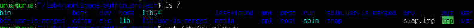

**Operating system version info:**  
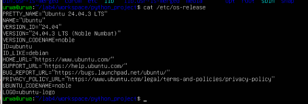

**Directory evidence listing:**  
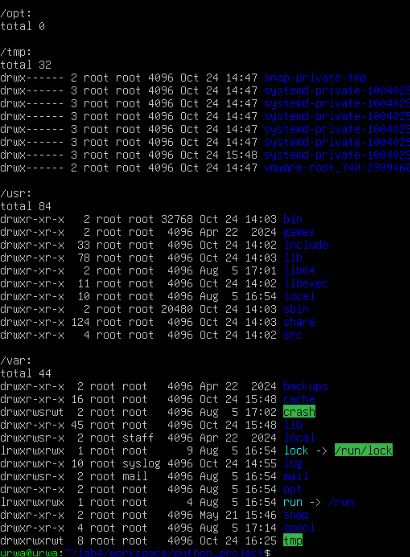

**Hidden files in home directory:**  
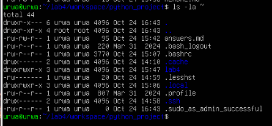

**Markdown summary report:**  
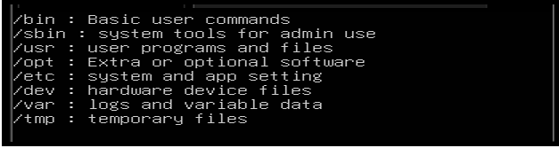

---

### Q3 – Evidence Handling & File Operations

**Workspace created for analysis:**  
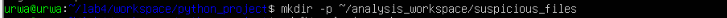

**Text and hidden files created:**  
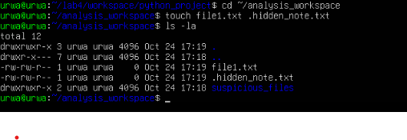

**Backup and renaming demonstration:**  
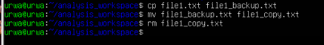

**Workspace copied as backup folder:**  
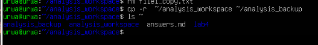

**Displayed command history:**  
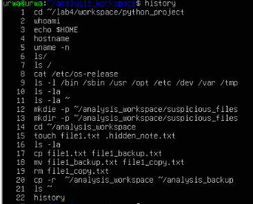

**Tab auto-completion demonstration:**  
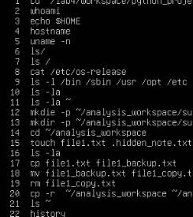

---

### Q4 – System Profiling & Process Monitoring

**System information (kernel & version):**  
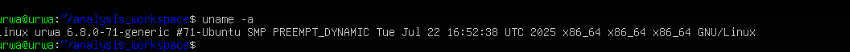

**Resource information (CPU, memory, disk):**  
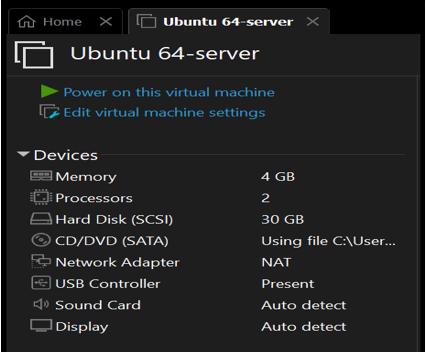

**List of active processes:**  
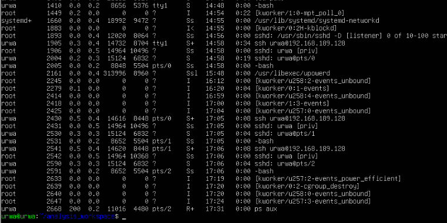

---

### Q5 – User Account Audit & Privilege Escalation Simulation

**New user lab4user added:**  
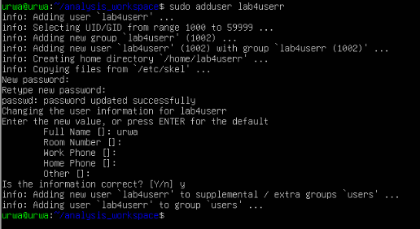

**User verified in system records:**  

**Login as lab4user:**  
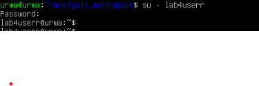

**Attempted sudo (permission denied):**  
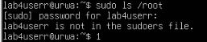

**Switched back to main account:**  
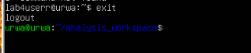

**Authentication logs analysis:**  
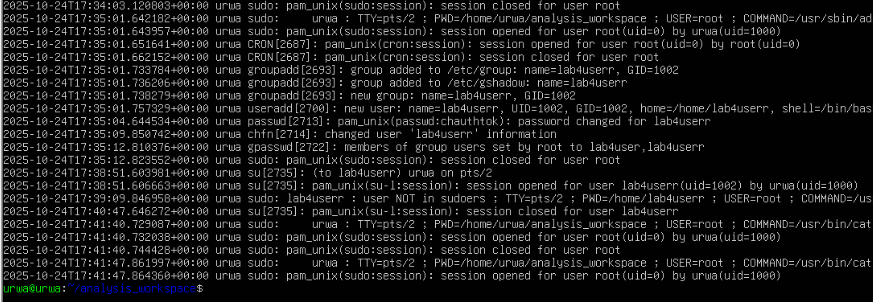

**Deleted user after audit:**  
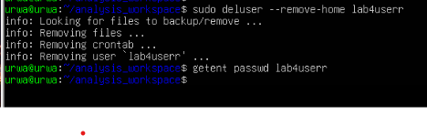

---

✅ **End of Lab 04 Report**
