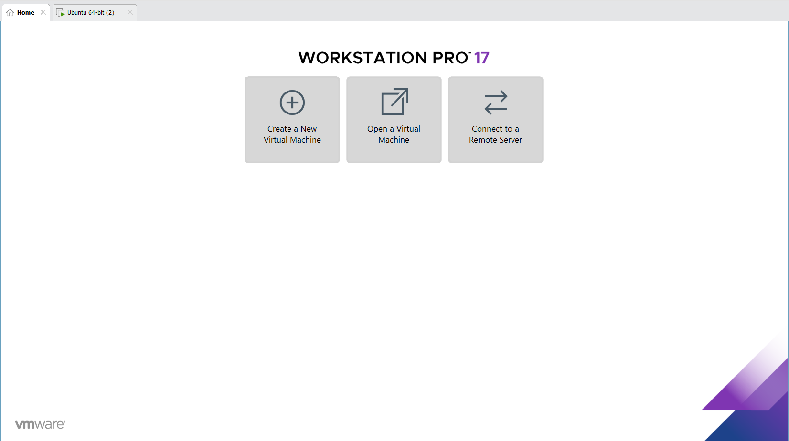
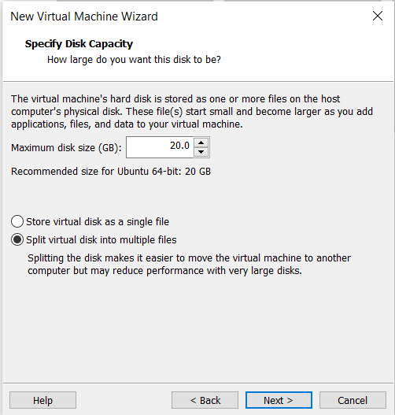
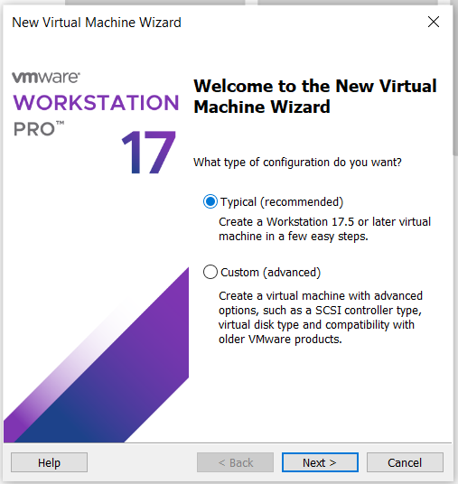
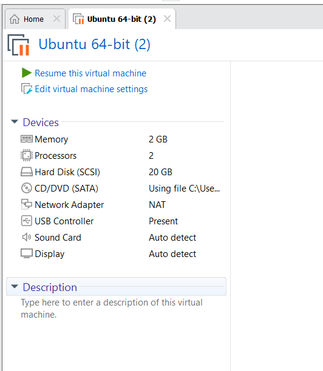
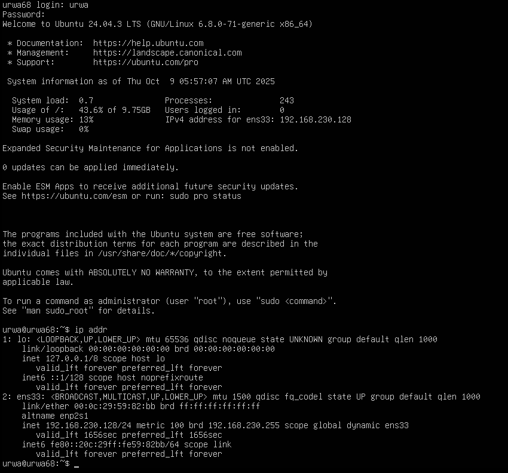
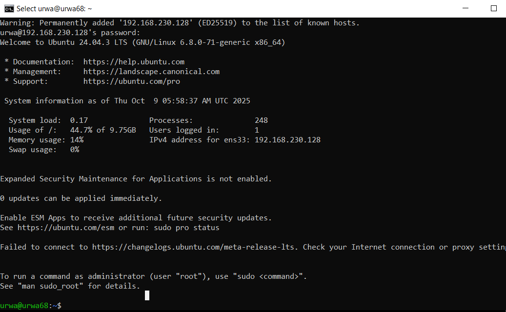

# Cloud Computing – Lab 1

## Submitted by
**Name:** Urwa Zahra  
**Registration Number:** 2023-BSE-068  

## Submitted to
**Instructor:** Sir Shoaib  

---

## Lab 1: Virtual Machine Setup and Configuration

### Step 1: Install VMware
Install **VMware Workstation** or **VMware Player** on your system to create and manage virtual machines.

---

### Step 2: Check Machine Capacity
Before creating a virtual machine, ensure your computer has sufficient CPU, RAM, and disk space.

---

### Step 3: Install Ubuntu
Create a new virtual machine in VMware and install **Ubuntu** as the guest operating system.  
Follow the Ubuntu setup steps shown below:

  
  

---

### Step 4: Virtual Machine Created
Once Ubuntu installation is complete, verify that the **virtual machine** has been successfully created.

---

### Step 5: Power On the Machine
Start (power on) the Ubuntu virtual machine to begin using it.

---

### Step 6: Check IP Address
After powering on, open the Ubuntu terminal and run the following command to view your IP address:

ip addr
### Step 7: Run ssh command on cmd prompt
Run ssh command as ssh urwa@ip addr
